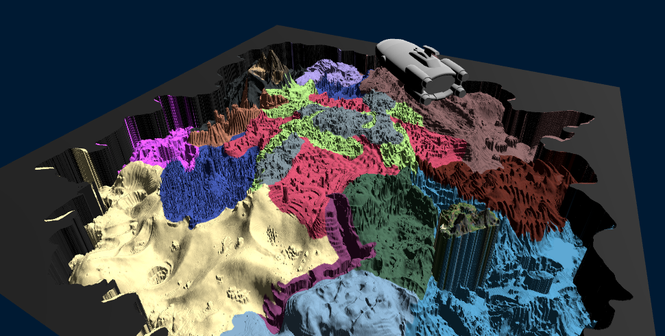

# SubnauticaMap

3D map of Subnautica:



Video Preview (hosted on Dropbox):

https://www.dropbox.com/scl/fi/7k1jcrl83a2g817ghvxfx/Subnautica3Dmap.mkv?rlkey=1265jzvnk81ttk678aswn3uop&st=nrr45vek&dl=0


## Running Map

In order to run map locally, open cmd/terminal and navigate to project folder. Launch a python http server:
```python
python -m http.server 8000
```

In your browser, you should be able to open the following and find html files in the folder:
```
http://localhost:8000/
```

## HTML Files

Development stages
* v0: Minimal working example to make sure Three.js works
* v1: Spinnable 3D grid
* v2: Simplified seafloor plot
* v3: Subnautica seabed
* v4: Aurora model, texture with biome mapping/island colors

## How it works

* The map information used to be available in the game folder, but it has since been hidden in proprietary binary files and is difficult to extract.
* I found `MAP.png` which was uploaded a long time ago, and which shows the depth information for the Subnautica world.
* The python file `genDepthJSON_from_MAP.py` reads the contents of `MAP.png` and creates a 2D json array with the depth information called `heightmap.json`.
* Using `Three.json` we can read the `heightmap.json` and display the Subnautica seabed.
* We can also add a texture and colorize the seabed. I use `biomemap.png` and in-game colors for the islands. In **Inkscape** I used the file `createTexture.svg` to create a rough texture.

I had some problems mapping the height/depth data exactly, which is why I use `genSCALEjson.py` to generate the json file `color_to_depth.json` which generates a mapping from the colors in `MAP.png` to depth information. This wasn't completely accurate and I ended up with some gray areas I fixed manually.

A lot of this was done with the help of ChatGPT. :-)

### Things to fix/extensions

I probably won't do any of these, but the next things I would try to fix:

* Fix borders which are the creater edge.
* Fix rough colorization
* Remove the "columns" that are created - like for the Floating Island
* Add the cave systems (I included `CAVE1-3.png` with the height data)
* Add some additional simple 3D-models for wrecks, escape pods and alien buildings
